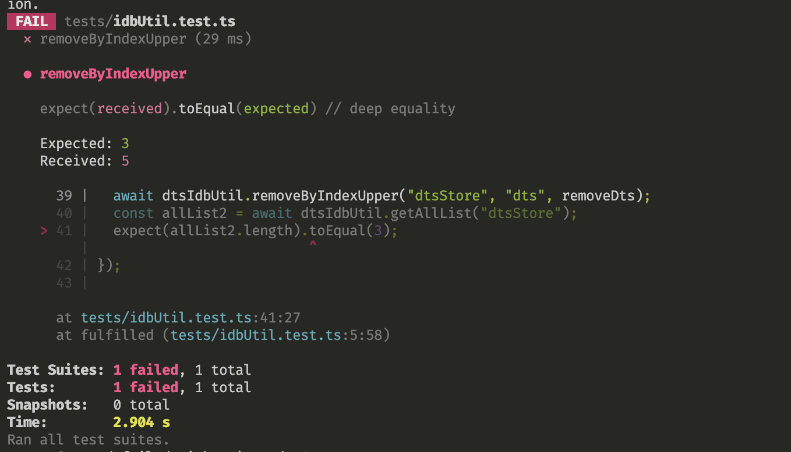

# Test Repo for fakeindexeddb + jest

## My Environment
node: v20.9.0

## What's the problem
`expect(allList2.length).toEqual(3);`

if my code is work correct, `removeByIndexUpper` will remove 2 records.

so the test suite will be passwd.

## How to reproduce
```
  yarn jest
```



If you uncomment the 

`// this.global.Date = Date;`

You will get PASSED.